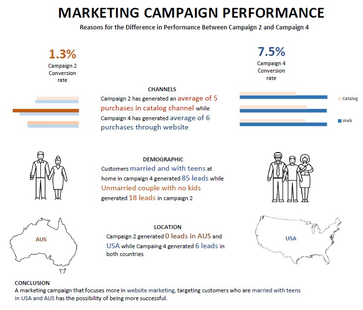

# Marketing Campaigns
For the Maven Marketing Challenge, you will be assuming the role of a newly-hired BI consultant for Maven Marketing, a small digital marketing agency. Their latest marketing campaigns have underperformed, and they have brought you in to analyze their data and propose a solution.
Data source: [Maven analytics](https://mavenanalytics.io/challenges/maven-marketing-challenge/19)

## Task
Pitch your No.1 recommendation to improve the impact of future marketing campaigns, and show the analysis to support it.

## Design and Approach
* Calculate conversion rates for each campaign. Calculated by dividing the number of leads by the total number of people who were exposed to the campaigns

  **Conversion rates**
  
  > Campaign 1 - 6.4%
  
  > Campaign 2 - 1.3% poor performnce
  
  > Campaign 3 - 7.3%
  
  > Campaign 4 - 7.5% good performance
  
* Using the data to compare performance of campaigns in different aspects like age groups, customer loyality, income, sales of products, channels, and location that performed good with the one performed poorly
* Create an infograph to share the insights

## Visualization

